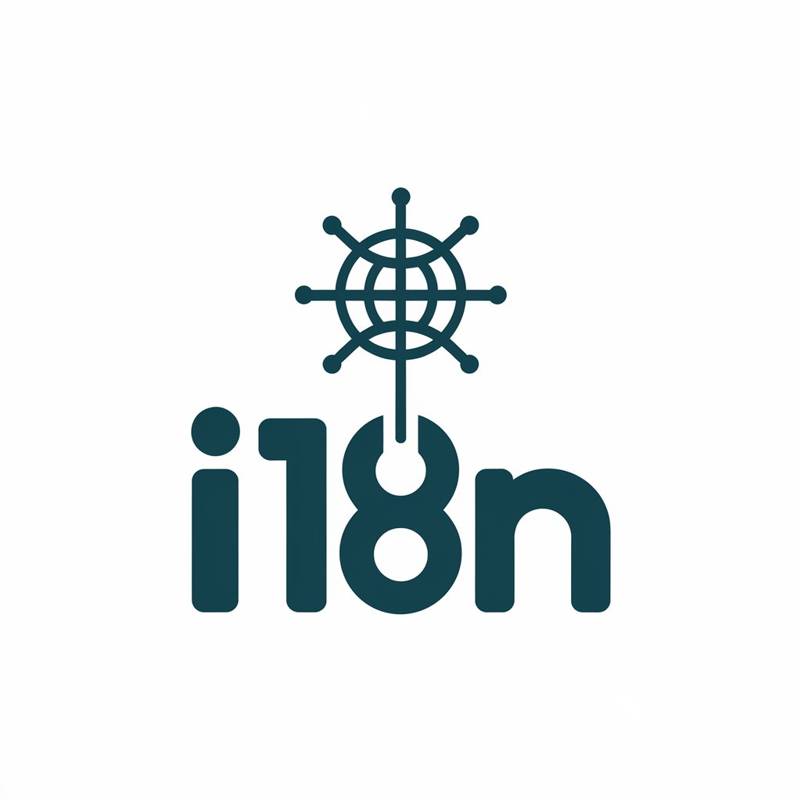
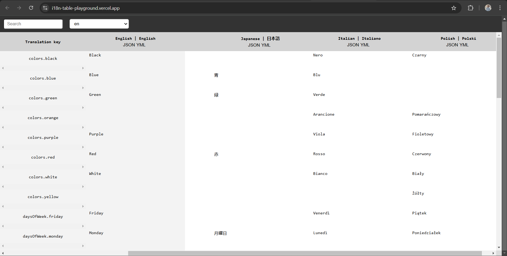

# Monorepo of i18n-table


<br>
> [!Note]
> If you want to see `README` file of `i18n-table`, check it [here](./lib).

## Get started

You can start `playground` project locally. It's NextJS application with basic `i18n-table` implementation.

### home page




1. Requirements

```
Node v20.11.0
npm v10.4.0
```

2. Install dependencies

```
npm install
```

3. Start project in development mode

```sh
npm run dev
```
